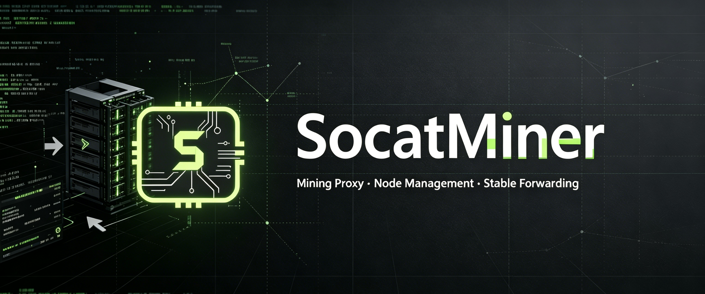

<div align="center">
    


# SocatMiner

**High-Performance Mining Pool Proxy & Full-Link Node Management System**

<h4 align="center"> MinerProxy </h4>

<p>
    
  <a href="https://t.me/SocatMiner">
    
  </a>
  <a href="LICENSE">
    
  </a>
  <a href="https://github.com/SocatMiner/SocatMiner">
    
  </a>
  
  
</p>
<p>
  <a href="https://github.com/735840086/SocatMiner">Repository</a>
  ·
  <a href="https://github.com/735840086/SocatMiner">Documentation</a>
  ·
  <a href="https://t.me/SocatMiner">Telegram</a>
</p>
<p>
  <a href="README.md">📜 简体中文</a>
  ·
  <strong>📜 English</strong>
</p>

</div>

---

## 📚 Introduction

**SocatMiner** is a high-performance traffic forwarding proxy system for mining rig clusters, with mining pool proxy and full-link node management capabilities. Designed for large-scale mining farms, mining pool node forwarding operators and professional O&M teams, it provides core features including high-performance connection forwarding, multi-rate management and visualized real-time monitoring.

Built with a zero-copy asynchronous architecture, a single node can support **10,000+** concurrent mining rig connections with low latency. Combined with Socat Proxy, it enables end-to-end encrypted transmission, effectively defending against attacks, carrier DPI inspection and traffic sniffing.

> **Design Philosophy**: Stability First · Ultimate Performance · O&M Friendly · Minimal Operation

---

## ✨ Core Features

<div align="center">
    
| Feature | Description |
|:---:|:---|
| 🎯 **Mining Pool Proxy Forwarding** | Supports multiple mainstream mining algorithms and stably connects to major mining pools worldwide | 
| ⚡ **Mining Pool Node Forwarding** | One-click Stratum node deployment, supporting custom fee rates, hashrate splitting and multi-level account system |
| 🔐 **Secure Transmission Tunnel** | Multi-layer protection with proprietary encryption protocols, paired with a local security client for data compression and link encryption |
| 📊 **Real-Time Monitoring Dashboard** | Web management backend provides multi-dimensional visual dashboards for hashrate trends, online status, revenue statistics and more |
| 🌐 **Platform Deployment** | Linux x86 architecture supported, one-click deployment |

</div>

---

## 💰 Supported Coins

<div align="center">

## 🔥 Mainstream Coins


###


</div>

<details>
<summary><strong>📋 Full Algorithm Support List</strong></summary>

| Algorithm | Supported Coins |
|:---|:---|
| **SHA256** | BTC, BCH, SPACE, NMC |
| **Ethash / Etchash** | ETC, ETHW, ETHF, OCTA, CLORE, NEURAI, NEOXA, ZIL, CLO, UBQ, PWR, BTN |
| **Scrypt** | LTC, BEL, DOGE |
| **kHeavyHash** | KASPA, PYI, SDR, KLS |
| **Blake2s** | KDA |
| **Blake2b** | SC, HNS, Siacoin |
| **Octopus** | CFX |
| **DynexSolve** | DNX |
| **Eaglesong** | CKB |
| **Equihash** | ZEC, ZEN, BTG |
| **RandomX** | XMR, ZEPH, NEVO |
| **KawPow** | RVN, MEWC, AIPG |
| **Autolykos2** | ERG |
| **NexaPow** | NEXA |
| **Blake3** | ALPH, IRON |
| **GhostRider** | RTM, RTC, MECU, MAXE |
| **Cuckatoo32** | GRIN |
| **ProgPow** | SERO, FIRO |

</details>

---

## 🏊 Supported Mining Pools

<div align="center">
<table>
  <tr>
    <td align="center" width="140">
      <a href="https://www.f2pool.com" target="_blank">
        
      </a>
      <br><sub>F2Pool</sub>
    </td>
    <td align="center" width="140">
      <a href="https://www.antpool.com" target="_blank">
        
      </a>
      <br><sub>AntPool</sub>
    </td>
    <td align="center" width="140">
      <a href="https://www.viabtc.com" target="_blank">
        
      </a>
      <br><sub>ViaBTC</sub>
    </td>
    <td align="center" width="140">
      <a href="https://www.poolin.com" target="_blank">
        
      </a>
      <br><sub>Poolin</sub>
    </td>
  </tr>
  <tr>
    <td align="center" width="140">
      <a href="https://www.binance.com/en/pool" target="_blank">
        
      </a>
      <br><sub>Binance Pool</sub>
    </td>
    <td align="center" width="140">
      <a href="https://foundrydigital.com" target="_blank">
        
      </a>
      <br><sub>Foundry</sub>
    </td>
    <td align="center" width="140">
      <a href="https://www.btc.com" target="_blank">
        
      </a>
      <br><sub>BTC.com</sub>
    </td>
    <td align="center" width="140">
      <a href="https://icriver.net" target="_blank">
        
      </a>
      <br><sub>iCriver</sub>
    </td>
  </tr>
  <tr>
    <td align="center" width="140">
      <a href="https://miningpoolstats.stream" target="_blank">
        
      </a>
      <br><sub>MiningPoolStats</sub>
    </td>
    <td align="center" width="140">
      <a href="https://www.nicehash.com" target="_blank">
        
      </a>
      <br><sub>NiceHash</sub>
    </td>
    <td align="center" width="140">
      <a href="https://www.miningdutch.nl" target="_blank">
        
      </a>
      <br><sub>MiningDutch</sub>
    </td>
    <td align="center" width="140">
      <a href="https://prohashing.com" target="_blank">
        
      </a>
      <br><sub>ProHashing</sub>
    </td>
  </tr>
  <tr>
    <td align="center" width="140">
      <a href="https://zergpool.com" target="_blank">
        
      </a>
      <br><sub>ZergPool</sub>
    </td>
    <td align="center" width="140">
      <a href="https://www.luxor.tech" target="_blank">
        
      </a>
      <br><sub>Luxor</sub>
    </td>
    <td align="center" width="140">
      <a href="https://braiins.com" target="_blank">
        
      </a>
      <br><sub>Braiins</sub>
    </td>
    <td align="center" width="140">
      <a href="https://2miners.com" target="_blank">
        
      </a>
      <br><sub>2Miners</sub>
    </td>
  </tr>
</table>
<sub>Compatible with all standard Stratum protocol mining pools</sub>
</div>

---

## 🚀 Quick Deployment

### System Requirements

| Configuration | Minimum | Recommended |
|:---|:---|:---|
| **Operating System** | Ubuntu 20.04 / CentOS 8 | Ubuntu 22.04 LTS |
| **CPU** | 0.5 core | 2 cores or higher |
| **Memory** | 512 MB | 2 GB or higher |
| **Bandwidth** | 10 Mbps | 100 Mbps or higher |
| **Storage** | 20 GB SSD | 50 GB SSD |

## 🌍 Linux One-Click Deployment
>Installation Script (Recommended)
```

/bin/bash -c "$(curl -fsSL https://raw.githubusercontent.com/735840086/hhminer/main/hhminer.sh)"

```
>Installation Script (Domestic speed-up)
```

/bin/bash -c "$(curl -fsSL https://raw.githubusercontent.com/735840086/hhminer/main/hhminer.sh)"

```
After installation, visit https://ServerIP:Port to access the web management panel.


## 📊 Performance Benchmarks

| Metric | Value | Description |
|:---|:---:|:---|
| **Max Concurrent Connections** | 10,000+ | Single node, 4-core 8GB environment |
| **Forwarding Latency** | < 1 ms | P99 latency on intranet |
| **Memory Footprint** | ~ 100 MB / 1k connections | Extremely low memory overhead |
| **CPU Usage** | < 5% @ 1k connections | Asynchronous non-blocking architecture |
| **Crash Recovery Time** | < 3 seconds | Process watchdog with auto-restart |
| **Daily Hashrate Accuracy** | 99.9% | Share-level precise statistics |

---

## 📚 SocatProxy Security Client

| 🔐 **Secure Transmission Tunnel** | Multi-layer protection with proprietary encryption protocols, paired with a local security client for data
compression and link encryption |

| 🔐 **Security Client Usage** | [Click to view](https://github.com/735840086/SocatProxy) |

---

## 🌐 Community & Support

<div align="center">

[](https://t.me/SocatMiner)
[](https://discord.gg/socatminer)
[](https://x.com/socatminer)
[](https://github.com/SocatMiner/SocatMiner/issues)

</div>

### 😊 Special Thanks

&nbsp;&nbsp;&nbsp;&nbsp;&nbsp;&nbsp;&nbsp;


&nbsp;&nbsp;&nbsp;&nbsp;&nbsp;&nbsp;&nbsp;


&nbsp;&nbsp;&nbsp;&nbsp;&nbsp;&nbsp;&nbsp;


&nbsp;&nbsp;&nbsp;&nbsp;&nbsp;&nbsp;&nbsp;


&nbsp;&nbsp;&nbsp;&nbsp;&nbsp;&nbsp;&nbsp;


&nbsp;&nbsp;&nbsp;&nbsp;&nbsp;&nbsp;&nbsp;


&nbsp;&nbsp;&nbsp;&nbsp;&nbsp;&nbsp;&nbsp;


&nbsp;&nbsp;&nbsp;&nbsp;&nbsp;&nbsp;&nbsp;


&nbsp;&nbsp;&nbsp;&nbsp;&nbsp;&nbsp;&nbsp;


&nbsp;&nbsp;&nbsp;&nbsp;&nbsp;&nbsp;&nbsp;


&nbsp;&nbsp;&nbsp;&nbsp;&nbsp;&nbsp;&nbsp;


&nbsp;&nbsp;&nbsp;&nbsp;&nbsp;&nbsp;&nbsp;


&nbsp;&nbsp;&nbsp;&nbsp;&nbsp;&nbsp;&nbsp;


&nbsp;&nbsp;&nbsp;&nbsp;&nbsp;&nbsp;&nbsp;


&nbsp;&nbsp;&nbsp;&nbsp;&nbsp;&nbsp;&nbsp;


&nbsp;&nbsp;&nbsp;&nbsp;&nbsp;&nbsp;&nbsp;


<p>&nbsp;&nbsp;&nbsp;&nbsp;&nbsp;&nbsp;&nbsp;✅ Special thanks to the mining pools above for providing partial technical support</p>

---

## ✨ Cooperation

For customization, technical support or cooperation inquiries, please contact us via:
- 📧 Email: `18628808761h@sina.cn`
- 💬 Telegram: `@cm1388s`

---

## ⚖️ Terms of Service

> [!WARNING]
> **Compliance Notice**
>
> SocatMiner is subject to local legal jurisdiction. Regulatory requirements for cryptocurrency mining activities vary across countries and regions.
>
> Before using this software, please ensure that cryptocurrency mining and related activities are permitted in your jurisdiction. Users shall bear full responsibility for any violations of local laws and regulations.

<details>
<summary><strong>📜 Full Terms of Service</strong></summary>

### 1. Nature of the Software
SocatMiner is a mining pool protocol forwarding and node management tool. It is not a VPN or network proxy product, and does not provide functions to bypass network restrictions or access prohibited content.

### 2. Prerequisites for Use
- You confirm that you have full ownership or legal management authority over the connected mining rigs
- All connected devices are configured with connection addresses by their respective owners
- You are not listed on any terrorist organization or sanctions list
- Cryptocurrency-related activities are permitted in your region

### 3. Restricted Regions
This software is not available to users in the following regions:
- Mainland China
- Sanctioned countries including Cuba, Iran, North Korea, Syria
- Other jurisdictions where cryptocurrency mining is explicitly prohibited

### 4. Disclaimer
- This software is provided "as is" without any express or implied warranties
- The developers shall not be liable for any direct or indirect losses arising from the use of this software
- Users assume full responsibility for any legal consequences caused by violations of local laws and regulations
- This tool is completely free of charge. There are no activation fees, subscription fees or backend service charges.
- A fixed 0.2% development and maintenance fee is deducted uniformly from terminal device hashrate, which is fully used for version iteration, server operation and technical updates.

By using this software, you acknowledge that you have read and agree to all of the above terms.

</details>

---

## 📄 License

This project is open-sourced under the [MIT License](LICENSE).

---

<div align="center">
**If this project helps you, feel free to give us a ⭐ Star to show your support**

Made with ❤️ by SocatMiner Team
</div>
